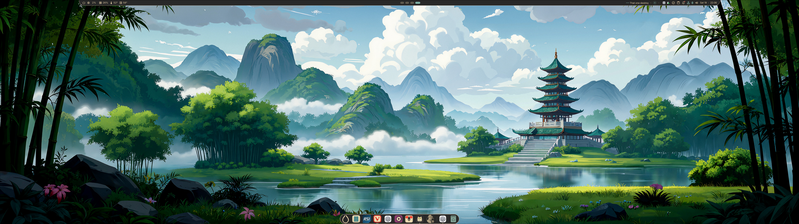
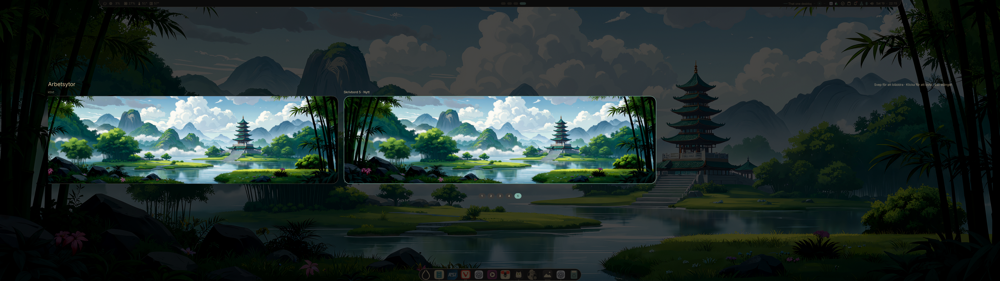
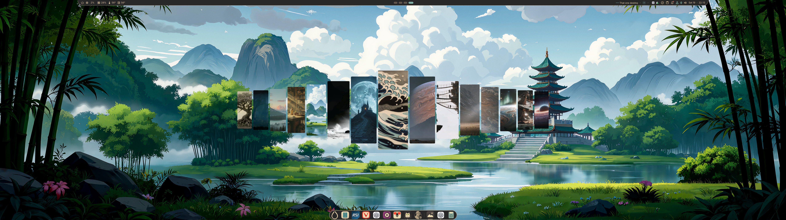
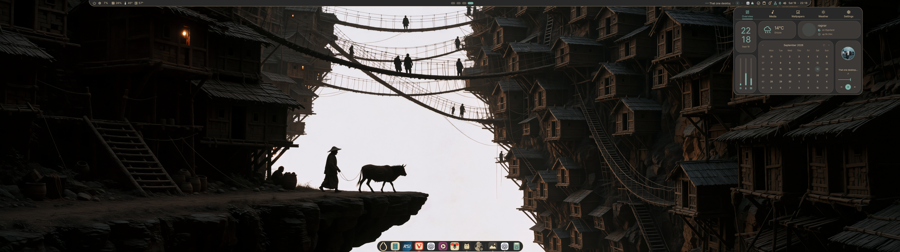

# Bifröst Shell

A beginner-friendly, trackpad-first Hyprland desktop built on DankMaterialShell, with custom gestures, workspace previews, a wallpaper carousel and Gruvbox styling.

Bifröst provides a starting point for people new to Hyprland: a coordinated bar, dock, theme and gesture configuration that you can explore and adapt instead of building everything from scratch. It is a collection of dotfiles, assets and customized shell code, not a Linux distribution.

## Screenshots

### Desktop

Gruvbox styling, a transparent topbar and an automatically hiding dock.



### Workspace overview

Browse workspace previews with two fingers and click to switch.



### Wallpaper carousel

Open with Super+W, scroll with two fingers and click a wallpaper to apply it.



### Dashboard

Quick access to the clock, calendar, media and desktop controls.



Screenshots show the original desktop; some labels use the system's Swedish locale.

## Included

- Customized DankMaterialShell 1.6.1, including the bar, dock and workspace overview.
- Gruvbox Multi (material-hard-dark, blue accent), Gruvbox-Plus-Light icons and Bibata Modern Ice cursors.
- Bundled Inter, Fira Code Nerd Font and Material Symbols panel fonts.
- Workspace previews: scroll with two fingers; click a workspace to switch. Browsing does not change the active workspace.
- **Super+W wallpaper carousel:** two-finger scrolling, narrow cards progressively smaller away from the center, one click to choose, and click outside to close.
- 15 decorative wallpapers, with embedded metadata removed.
- Latest exported edge-snap configuration: preview while dragging a floating window, half-screen placement on release and restoration of its saved floating size when dragged again. Mouse and three-finger gesture paths are present. Only the dragged window is changed.
- A per-workspace floating/tiling script, separate from the existing global keyboard shortcut.

No session history, location data, clipboard, notes, accounts, credentials, browser profiles or unrelated home files are included. The local Mac sound pack is excluded.

## Trackpad and shortcuts

| Input | Action |
|---|---|
| Three-finger drag | Move floating windows with snap preview; directional rearrangement for tiled windows |
| Four fingers up | Toggle the current window between floating and tiling |
| Four fingers down | Close the current window |
| Four fingers left/right | Switch workspace |
| Four-finger pinch together | Open workspace overview |
| Four-finger pinch apart | Close workspace overview |
| Super+Tab | Visible window switcher, most recently used first |
| Super+Shift+Tab | Open the window switcher backwards |
| Super+O | Workspace overview |
| Super+W | Wallpaper carousel |
| Super+Shift+Space | Existing **global** floating/tiling toggle |
| Super + left mouse drag | Move a window; snap-aware for floating windows |

Tap-to-click, natural scrolling and `drag_lock = 1` are enabled. Do not run the old external `three-finger-drag.service` alongside these gestures. Alt+Tab is not configured in this export.

The custom three-finger handler uses real start/update/finish callbacks. For tiled windows it rearranges on release rather than reproducing the original built-in move animation.

To toggle only the active workspace:

```bash
bash "$HOME/.config/hypr/scripts/workspace-floatmode-toggle.sh"
```

The script records which windows it floated and restores those on toggling back. New windows follow that workspace's generated rule; other workspaces retain their own rules.

## Window switcher

Hold Super and press Tab to display running windows with application icons and titles. Continue with Tab or the arrow keys; Shift+Tab moves backwards. Release Super or press Enter to select, or Escape to cancel. Overview remains on Super+O and the four-finger pinch gesture.

Rofi uses `-global-kb` to request that compositor shortcuts be inhibited while the picker is open. The latest keyboard-capture correction is included; physical keyboard navigation on the source system still awaits user confirmation. Default Tab bindings are cleared to avoid duplicate-binding errors. Window titles and addresses are kept in memory and are not saved.

## Requirements

Developed on **CachyOS, Magic Trackpad and a 5120×1440 display**. Other distributions, devices and resolutions have not been fully tested.

Reference versions: **Hyprland 0.56.2 with native Lua configuration**, **DMS 1.6.1** (shell revision `19a5eee1e217e936`), **Qt 6.11.2**, **libinput 1.31.3**. These are reference versions, not a claim of compatibility with all newer releases.

Install these before applying the configuration:

- Hyprland with the Lua `hl.*` API, including gesture lifecycle callbacks.
- DankMaterialShell (`dms`) and its runtime dependencies.
- Quickshell (`qs` and `quickshell`) with Qt Quick, Qt5Compat and the modules required by DMS.
- Git, Python 3, Bash, jq and ImageMagick (including the `convert` compatibility command used by the thumbnail script).
- A working systemd user session and D-Bus environment.
- Rofi with Wayland support (configured with Rofi 2.0.0) for the window switcher.
- Kitty for the default terminal shortcut; `notify-send` for toggle notifications.
- Adwaita icons/fonts and Noto as system fallback resources.

The shell's optional controls (audio, brightness, updates, networking, etc.) also depend on the relevant DMS/system services being available. This installer does not set up an operating system or install packages.

## Install on a fresh CachyOS system

These commands target a fresh CachyOS installation with working graphics drivers, Internet access and a systemd user session. Select Hyprland in the CachyOS installer or your login screen. Run the desktop setup from a terminal **inside your Hyprland session**, as your normal user; use `sudo` only where shown. Do not run `install.py` as root.

### 1. Update and install the desktop packages

```bash
sudo pacman -Syu
sudo pacman -S --needed hyprland dms-shell quickshell rofi kitty git python jq imagemagick libnotify qt6-5compat qt6-svg qt6-wayland qt6-multimedia qt6-shadertools matugen wl-clipboard cliphist wtype cava xdg-desktop-portal-hyprland xdg-desktop-portal-gtk adwaita-fonts adwaita-icon-theme noto-fonts noto-fonts-emoji
```

Pacman installs transitive dependencies automatically. If DMS asks you to choose a compositor provider, choose **dms-shell-hyprland**, not Niri. Repository packaging can change; if a package cannot be found, stop and check the official links below rather than downloading a similarly named package from an unknown source.

Check versions before replacing your configuration:

```bash
hyprctl version
dms --version
qs --version
rofi -version
```

The exported configuration uses Hyprland's Lua API and DMS 1.6.1 shell code. A newer package is not automatically guaranteed compatible; see the reference versions above.

### 2. Install the recommended file manager

Nautilus is the file manager used with this desktop. GVfs provides support for removable drives and other file locations; MTP support is useful for phones.

```bash
sudo pacman -S --needed nautilus gvfs gvfs-mtp
```

Optional: make it the default folder handler:

```bash
xdg-mime default org.gnome.Nautilus.desktop inode/directory
```

### 3. Audio

Fresh CachyOS normally provides PipeWire already. The following ensures the expected audio components are present:

```bash
sudo pacman -S --needed pipewire pipewire-pulse wireplumber
systemctl --user enable --now pipewire.socket pipewire-pulse.socket wireplumber.service
wpctl status
```

If this is an existing system using PulseAudio or another session manager, review package conflicts before switching audio stacks. Do not enable competing session managers.

### 4. Optional hardware controls

Install brightness and power-profile support if your hardware supports them:

```bash
sudo pacman -S --needed brightnessctl power-profiles-daemon
```

Enable power profiles only if another power-management service such as TLP is not already managing the machine:

```bash
sudo systemctl enable --now power-profiles-daemon.service
```

For Bluetooth, including a wirelessly connected trackpad:

```bash
sudo pacman -S --needed bluez bluez-utils
sudo systemctl enable --now bluetooth.service
```

Pair the device through the Bluetooth controls. For networking, keep the manager already configured by CachyOS. If a fresh installation has no network manager and you choose NetworkManager:

```bash
sudo pacman -S --needed networkmanager
sudo systemctl enable --now NetworkManager.service
```

Do not enable NetworkManager alongside another service already managing the same network interface.

### 5. Download and install Bifröst

```bash
git clone https://github.com/RagnarVarg/bifrost-shell.git
cd bifrost-shell

# Preview only: makes no changes
python3 install.py

# Copy configuration and assets, backing up files being replaced
python3 install.py --apply
```

Existing files are backed up under `~/.local/state/cachyos-shell-config/backups/`. Icons, cursor resources and panel fonts are bundled; no separate download is required for those included assets.

The default monitor profile uses the display's preferred mode. **Instead of the normal apply command**, use the following only for a matching DP-2, 5120×1440, approximately 240 Hz setup:

```bash
python3 install.py --apply --ultrawide
```

Optional icon-cache refresh:

```bash
gtk-update-icon-cache -f -t "$HOME/.local/share/icons/Gruvbox-Plus-Light"
```

### 6. Activate the customized shell

Only if the old external gesture tool was previously installed:

```bash
sudo systemctl disable --now three-finger-drag.service
```

On a fresh installation, skip that command. Then, from inside Hyprland:

```bash
systemctl --user daemon-reload
systemctl --user enable --now dms.service
systemctl --user restart dms.service
hyprctl reload
hyprctl configerrors
```

The DMS override selects the customized shell directory. Empty output from `hyprctl configerrors` means no configuration errors were reported. If DMS fails to start, inspect the log instead of repeatedly restarting it:

```bash
systemctl --user status dms.service --no-pager
journalctl --user -u dms.service -n 80 --no-pager
```

Log out and back into Hyprland to start the snap-preview overlay. To start it in the current session **only if it is not already running**:

```bash
qs -n -d -p "$HOME/.config/hypr/scripts/snap-preview/shell.qml"
```

Alternative manual DMS launch, if you are not using the service:

```bash
dms -c "$HOME/.config/DankMaterialShell/shell" run
```

Do not run the manual instance alongside the service. Press **Super+W** to choose a wallpaper, **Super+O** for workspace overview and **Super+Tab** for the window switcher.

### 7. Test before relying on the installation

```bash
hyprctl configerrors
systemctl --user is-active dms.service
```

Check the bar, dock, volume controls, wallpaper selection, window switcher and trackpad gestures physically. This export has been syntax-checked and test-installed in an isolated directory; an end-to-end fresh-install test is still required.

To test file copying without modifying your real configuration:

```bash
python3 install.py --apply --target /tmp/bifrost-test
```

### Official package sources and redistribution

The commands above install software through CachyOS/Arch repositories; they do not redistribute proprietary installers or require copying software from another operating system. Package availability and licenses can change. Consult the [Arch DMS package](https://archlinux.org/packages/extra/x86_64/dms-shell/), [official DMS installation documentation](https://github.com/AvengeMedia/DankLinux-Docs/blob/master/docs/dankmaterialshell/installation.mdx) and the licenses shipped by the relevant projects.

**This is not a blanket copyright clearance for the repository's assets.** The original wallpaper collection, screenshots containing those wallpapers, the original wallpaper-selector code and the Gruvbox Multi theme still require confirmation of their applicable redistribution terms. Attribution alone does not establish permission. See [THIRD_PARTY.md](THIRD_PARTY.md) and [GitHub's licensing guidance](https://docs.github.com/en/repositories/managing-your-repositorys-settings-and-features/licensing-a-repository). No macOS sound files, Apple fonts or proprietary application binaries are included.

## Portability and current limitations

- Home-directory placeholders are substituted at installation. Snap preview uses `XDG_RUNTIME_DIR`, not a fixed user ID.
- A dedicated preview startup module is included because the source desktop's older `autostart.lua` was not loaded. Unrelated legacy autostart commands are excluded.
- The manual bar padding is tuned for ultrawide and needs adjustment on smaller screens.
- Edge snapping uses a fixed **2 px border**; update its `BORDER_SIZE` constant if changing that setting. The source configuration targets a scale-1 monitor at position 0,0. Mixed scaling, rotation and multi-monitor preview coordinates need further testing.
- Saved pre-snap sizes are held in compositor memory, not persisted across login sessions.
- This is a snapshot of customized DMS code. Future DMS updates may require manually merging changes.

## Validation

The export is reviewed for private paths and common credential patterns. Installation is tested in a separate directory, including backup behavior, required Lua module paths and script syntax. Edge-snap callbacks are covered by a mocked Lua regression test (`lua tests/edge-snap.lua`). These checks do not replace physical trackpad testing on the destination computer.

## Credits and licenses

Built on [DankMaterialShell](https://github.com/AvengeMedia/DankMaterialShell), Hyprland and Quickshell. Original third-party notices and font/icon licenses are retained; see `THIRD_PARTY.md`. No new blanket license is applied to third-party wallpapers or assets.
